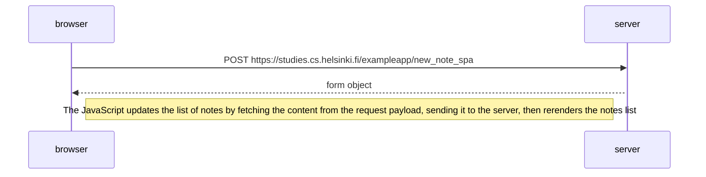

```mermaid
sequenceDiagram
    participant browser
    participant server

    browser->>server: POST https://studies.cs.helsinki.fi/exampleapp/new_note_spa
    activate server
    server-->>browser: form object

    Note right of browser: The JavaScript updates the list of notes by fetching the content from the request payload, sending it to the server, then rerenders the notes list
```